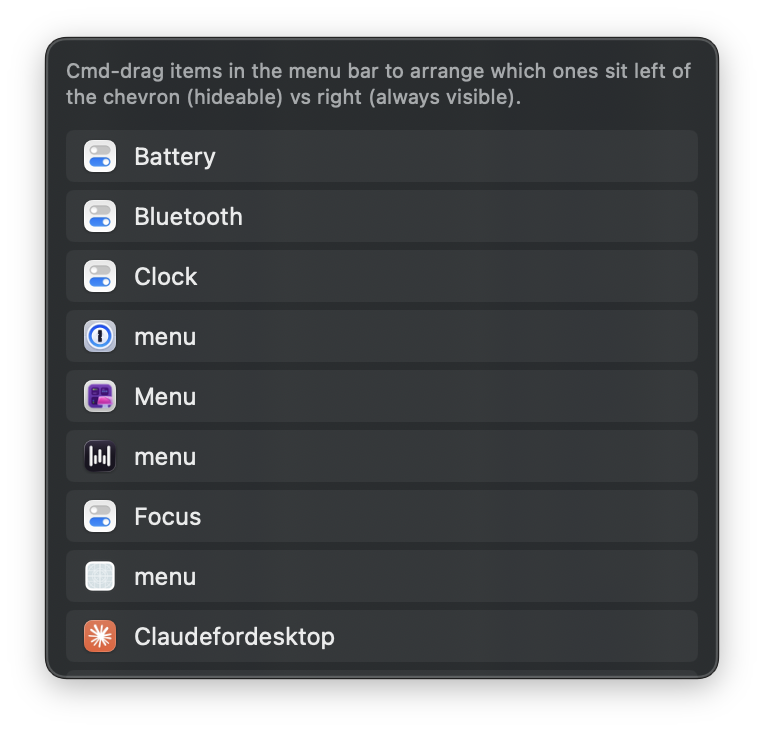
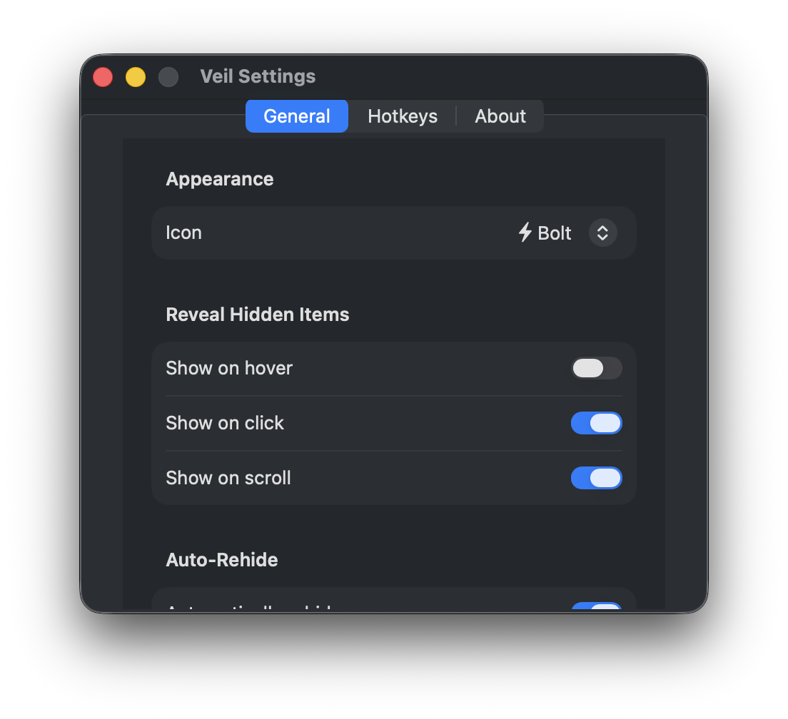
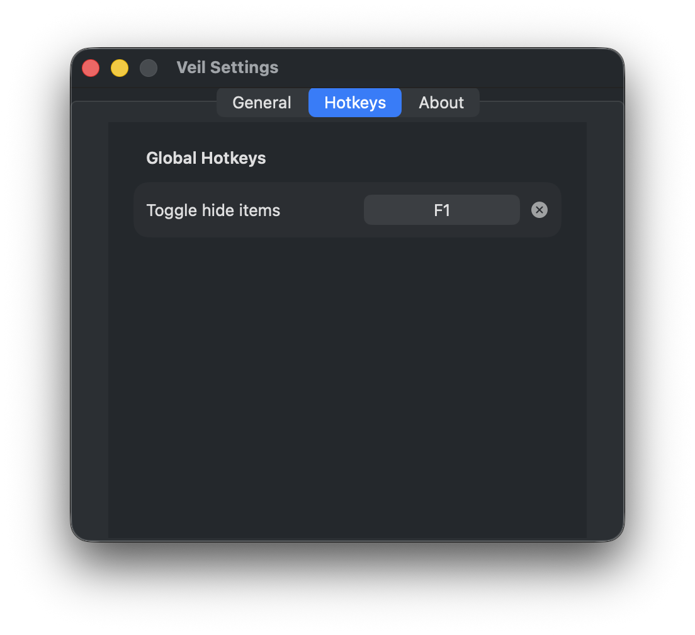

# Veil

> Hide the noise in your menu bar.

A lightweight macOS menu bar manager. Click the bolt to push cluttering items off-screen; click again to bring them back.


- **Zero idle CPU.** Event-driven, no polling.
- **Small footprint.** ~80 MB RSS, single binary, no external dependencies.
- **No private APIs in the hot path.** Pure AppKit + Carbon (for global hotkeys).
- **MIT-licensed clean-room rewrite.** Owes nothing to Ice or Bartender.

## How it works

macOS Sonoma+ blocked the AX and CGS paths that previously let third-party apps move other apps' menu bar items. Veil works around that with the only technique still available: it grows its own status item to a wide push width, which shifts everything to its left off the visible portion of the menu bar. Click again to collapse the push width back to a single icon.

That model has a real constraint: hiding is **all-or-nothing for items left of the bolt**. Cmd+drag to reposition items in the menu bar so the ones you want to hide live left of the bolt, and the ones you always want visible (like Stats indicators) live to its right.

System items like Wi-Fi, Bluetooth, Battery, and Control Centre are owned by macOS itself and can only be hidden via System Settings → Control Centre. Veil can't touch them.

## Install

### Download (Apple Silicon, macOS 14+)

Grab `Veil.zip` from the [latest release](https://github.com/zlahham/Veil/releases/latest), unzip it, and drop `Veil.app` into `/Applications`.

The build is ad-hoc signed (not yet notarized through Apple's Developer Program), so Gatekeeper will refuse to open it on first launch. Right-click `Veil.app` → **Open** → confirm — macOS will remember the choice. A notarized Homebrew cask is planned.

### From source

```bash
git clone https://github.com/zlahham/Veil.git
cd Veil
make install
```

`make install` builds with SPM, scaffolds `Veil.app/` at the project root, ad-hoc codesigns it (so Accessibility grants survive rebuilds), and launches it. Requires Xcode (or the full Command Line Tools) on macOS 14+.

## First launch

Veil shows a welcome window and asks for **Accessibility** permission. It uses this only to read the titles of menu bar items so it can list them in the Ice Bar. It does not click, modify, or send events on your behalf.

## Usage

- **Left-click the bolt** — toggle hide/show.
- **Right-click the bolt** — context menu (Show Item List, Settings, Quit).
- **Global hotkey** — assignable in Settings → Hotkeys.
- **Cmd+drag any menu bar item** — reposition it. macOS persists positions; Veil works with whatever order you choose.

### Item list (right-click → Show Item List)



Lists everything Veil can see in your menu bar, including the items currently pushed off-screen. Clicking a row activates the owning app.

### Settings

| | |
|--|--|
|  |  |
| **General** — pick an icon (bolt, sparkles, moon, eye, cloud), reveal-on-hover/click/scroll, auto-rehide delay, launch at login. | **Hotkeys** — global combo to toggle hide. |

## Development

```bash
swift build       # SPM build
make install      # Build + bundle + sign + launch
make icon         # Regenerate the app icon
make clean        # Remove .build/
```

The Makefile's `make sign` target ad-hoc codesigns the bundle; this keeps the same code identity across rebuilds, so macOS doesn't ask you to re-grant Accessibility every time.

### Project layout

```
Sources/Veil/
├── App/              # AppDelegate, AppController, FirstRunWindow
├── MenuBar/          # ControlItem (the bolt), MenuBarController
├── IceBar/           # Ice Bar panel listing items
├── Events/           # Hover/click/scroll monitors
├── Hotkeys/          # Carbon-backed global hotkey service
├── Settings/         # SwiftUI Settings tabs
├── Persistence/      # UserDefaults wrapper, VeilIcon enum
└── Utilities/        # Notifications, Permissions, NSScreen helpers
```

## License

MIT. See [LICENSE](LICENSE).
